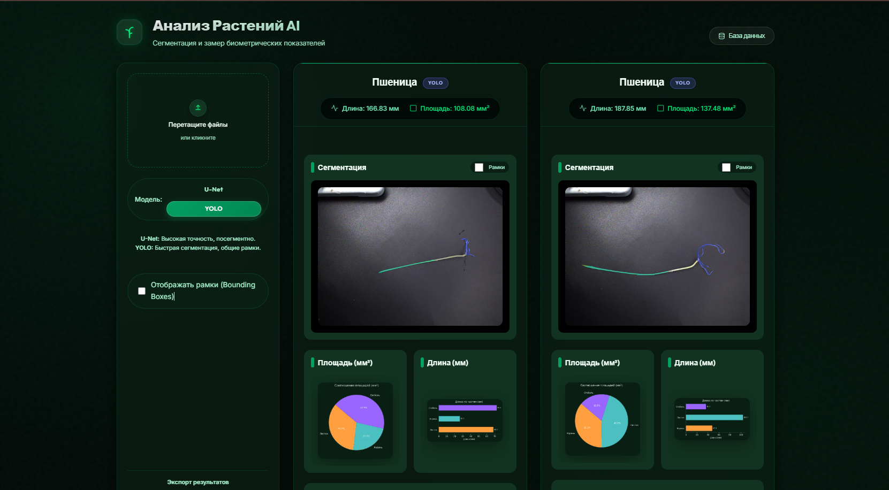

# Plants Verification Size (PvZ) - AI Агрономия 🌿

Комплексное решение для автоматизации анализа биометрических показателей растений (пшеница и рукола). Система использует передовые модели компьютерного зрения для классификации, сегментации и точного измерения площади и длины частей растений.

## 🌟 Основные возможности

-   **Dual-Model Segmentation**: Поддержка двух типов архитектур для сегментации:
    -   **YOLO (v8/v11)**: Высокая скорость и детекция отдельных объектов (инстанс-сегментация).
    -   **U-Net (ResNet50)**: Максимальная точность попиксельной маски для сложных структур.
-   **Автоматическая классификация**: Система сама определяет тип растения (Рукола или Пшеница) перед анализом.
-   **Точные биометрические метрики**:
    -   Расчет площади (мм²) и длины (мм) для корней, стеблей и листьев.
    -   Автоматическая калибровка масштаба (мм/пиксель).
-   **Интерактивный Dashboard**:
    -   Фильтрация по частям растения в реальном времени.
    -   Визуализация статистики в виде графиков (распределение биомассы).
    -   Сравнение результатов работы разных моделей.
-   **Управление данными**:
    -   История всех анализов в локальной БД (SQLite).
    -   Экспорт результатов в ZIP-архив с детализированным CSV-отчетом и размеченными изображениями.
-   **Мультиплатформенность**: Современный Web-интерфейс (FastAPI) и Telegram-бот для полевых условий.

---

## 🎨 Интерфейс приложения



## 🔄 Схема работы системы

Процесс обработки изображения — от загрузки до генерации отчета:


---

## 🛠 Технический стек

### Machine Learning
-   **Ultralytics (YOLO)** — классификация и сегментация.
-   **PyTorch & Segmentation Models Pytorch (SMP)** — архитектура U-Net.
-   **OpenCV & Scikit-image** — обработка масок и скелетизация.
-   **Matplotlib** — генерация аналитических графиков.

### Backend & Web
-   **FastAPI** — высокопроизводительный асинхронный API.
-   **SQLAlchemy / SQLite** — хранение истории анализов.
-   **Jinja2** — динамические HTML-шаблоны.
-   **Vanilla CSS & JS** — премиальный UI в стиле Glassmorphism.

### Bot Interface
-   **Aiogram 3.x** — современный асинхронный фреймворк для Telegram-ботов.

---

## 💻 Быстрый старт

### 1. Требования
-   Python 3.10+
-   CUDA-совместимая видеокарта (опционально, для ускорения работы нейросетей)

### 2. Установка
```bash
git clone <repository_url>
cd Plants_Verefication_Size-PvZ-

# Создание и активация окружения
python -m venv venv
source venv/bin/activate  # Для Linux/Mac
# или
venv\Scripts\activate     # Для Windows

# Установка зависимостей
pip install -r requirements.txt
```

### 3. Настройка
Создайте файл `.env` в корне проекта (на основе `.env.example`):
```env
TELEGRAM_BOT_TOKEN=your_token_here
```

### 4. Запуск
**Веб-интерфейс:**
```bash
uvicorn app.main:app --reload
```
Доступен по адресу: [http://127.0.0.1:8000](http://127.0.0.1:8000)

**Telegram-бот:**
```bash
python bot.py  # Если основной скрипт бота находится в корне
```

---

## 📂 Структура проекта
-   `app/` — Backend логика, API эндпоинты и статичные файлы фронтенда.
-   `core/` — Ядро ML: инференс моделей, расчет метрик и генерация графиков.
-   `models/` — Веса обученных моделей (YOLO и U-Net).
-   `data/` — Локальная база данных SQLite.
-   `Readme_images/` — Графические материалы для документации.
